**INTRODUCTION TO THEORY**  
  
Our purpose here is not to write a textbook on physics, but rather to present this theory in its simplest form, so it may be understood by layman and physicist alike. We will make no attempt to appease the scientific community in this presentation, as we know from long experience that they will reject the evidence of their own eyes, if that evidence should challenge what they have accepted as physical "law". In other words then, this paper will simply explain what is happening in our physical world and why. All of the mathematical calculations that go with the theory will be left for another, more appropriate time.  
  
We will begin this discussion by stating that the force which unifies all things is motion, for without motion there is nothing, and we will then show the dynamics of a body in motion (falling body). From there we will enter into brief discussions on energy to mass conversion, mass to energy conversion, anti-matter, and will summarize with a short explanation of the equation which unifies all things, i.e., mass, energy and forces.  
  
It is not an easy task to relearn physics, we know, but this theory has been tested and is correct, so it is well worth the effort to study this material carefully. If what is being said is comprehended, the reader should be able to begin to apply the information to the earth in general, and to what is happening to the ionosphere in particular. Once atomic structure has been explained, the reader will also begin to see how, using technologies based on correct physics, we can repair the damage and place this planet back into its proper balance - if we work together.  
  
**UNITY OF ALL THINGS**  
  
**THEORY**  
  
We have already stated that motion is the catalyst by which all else exists. For this reason we refer to motion as the creative force. We will now further state that the four forces that have been identified by the scientific community are in reality one force in four of its different actions. This force manifests itself in different actions based on predictable conditions and its stage in a repetitious, wonderfully simple cycle called nature. Currently due to the work of Fischbach and Aronson, the scientific community is speculating that perhaps all bodies do not accelerate at the same rate, but instead of backing up and questioning existing "law", these scientists are now busy hypothesizing that there is yet another force, which they have tentatively named hypercharge. We know this is not correct! What they have stumbled upon is in fact no more than the unified force displaying its repulsive action. Our generic term for the unified force is neutral energy, and we will now attempt to show how it manifests itself in the physical world.  
  
**FALLING BODIES**  
  
For the purposes of this paper, the term falling body is defined as any body which moves, or "falls" through a gravitational field. This includes all sub-atomic particles, solar systems, galaxies, universes, universal vortexes, and yet greater expanses. As indicated in our tests and illustrated below, a falling body produces about itself a force of extracted energy.  
  

Fig. 14  
  
This extracted energy attempts to return to the body it's been extracted from. As shown in figure 14, this cycle produces a force around the body. The result is a gravitational field which will be felt as an attracting force by anything which exists within that field. As the arrows indicate, however, any body or thing which exists outside of this field will be pushed away (or repulsed) from the body. It must be understood - that which is generically referred to as gravity is not always an attracting force.  
  
The major line of extraction of energy from a falling body is at the leading edge of the fall of that body, as illustrated in figure 15.  
  

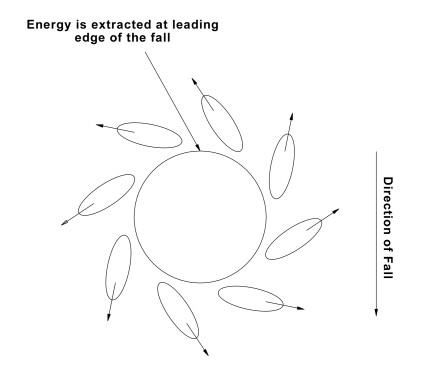

Fig. 15  
  
As has been indicated, the extracted energy attempts to return to the body it has been extracted from, however, motion at the rate of velocity squared will not allow this energy to return to the body. This pressure or "pull" is felt by the body, causing it to rotate in the direction of the energy extraction, as shown below.  
  

Fig. 16  
  
Size, velocity, composition of the body, and the value of the gravitational field the body falls through are all major factors in the rate of the rotation. For instance, the larger the body, the faster the rotation, and the greater the velocity of the body the faster it will rotate. Also, a falling body composed of steel will rotate faster than an equal sized body of carbon, the reasons for which will be discussed in greater depth in the segment on atomic structure.  
  
\[Missing Section\]  
  
The energy that's been extracted from the leading edge of a falling body presents an energy void to the body. This energy void is filled by an input of energy 90° from the leading edge of the falling body, as illustrated in figure 18.  
  

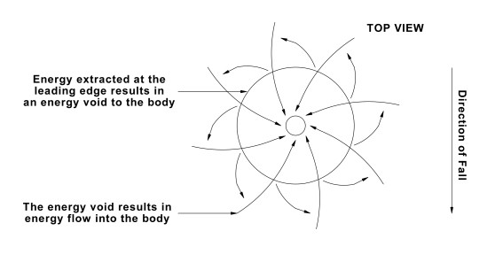

Fig. 18  
  
This input energy taken in at the point of rotation (90° from the leading edge) is what is seen as the magnetic poles, indicated below.  
  

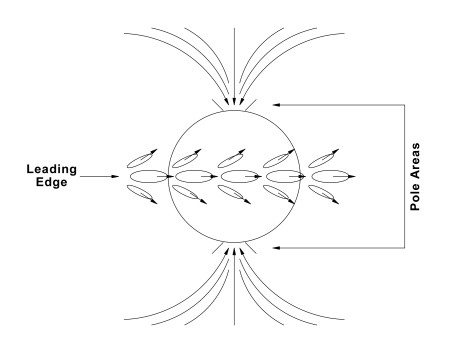

Fig. 19  
  
The energy flow into the poles, combined with the extraction of energy at the leading edge of the fall, produces an energy flow which results in a magnetic field, as seen in figure 20.  
  

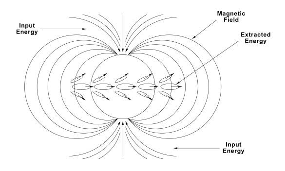

Fig. 20  
  
A group of bodies which were in formation before the onset of their fall will produce the same results as a single falling body, with a few exceptions. As shown in test three, when multiple bodies fall as a unit, they group themselves into a spherical formation. Having done this, they will produce the same extracted force as does a single body, shown below.  
  

Fig. 21  
  
At the same time, each individual body within this formation develops its own rotation, the rate of which depends upon the body's individual size and the velocity of the mass as a whole.  
  

Fig. 22  
  
As seen above, although these bodies combine their energies and rotate as a single body, each individual still obeys the laws of falling bodies as well, and so creates and maintains its own field, which repulses the fields of the other bodies. This repulsive action results in "space" between the bodies. It should also be noted that such a grouping of bodies falling in tight formation will continuously exchange pole positions, i.e., the north pole becomes the south pole and vice versa.  
  
Stated in simple terms, a falling body is an energy exchanger, or in other words, is a transducer. The energy extracted at the leading edge of the fall is consistently the same value - the same sized bubble. Even so, the poles will accept any energy which may be available, be it neutral energy (bubbles) or polarized energy. The interior of a falling body is quite comparable to a variable resistor. The value of resistance is inversely proportional to the velocity of the body at the rate of velocity squared. To repeat: resistance goes down as the velocity is increased. This is illustrated in figure 23.  
  

Fig. 23  
  
**ENERGY TO MASS CONVERSION**  
  
As indicated, a falling body is a transducer and all bodies are falling. Every body has a value of internal resistance which is inversely proportional to velocity. When a body obtains a velocity of .9 times the speed of light, the internal resistance becomes a negligible factor. The body now accepts greater amounts of energy than it can radiate. This surplus energy now becomes very compact, and the minute bubbles of energy begin to pack together, as shown in figure 24.  
  

Fig. 24  
  
As a result of this compression of bubbles, a particle of mass is formed. Mass is therefore no more than solidified energy. The compression of bubbles illustrated in figure 24 results in a particle, shown below.  
  

Fig. 25  
  
Should a falling body maintain a velocity of between 167,000 and 186,000 miles per second, the conversion from energy to mass would be infinite.  
  
**MASS TO ENERGY CONVERSION**  
  
As a body obtains the velocity of light, the internal resistance becomes zero. Energy continues to be extracted from the body at an accelerated rate. The velocity of the body is equal to, or greater than the velocity of energy. This means energy cannot overtake (or "catch up with") and enter the body. The great pressure (potential) extracts all the energy from the body. The sub-atomic particles begin to "shed" their outermost shells (i.e., bubbles), and this process will continue until no particle remains. All that does remain is a vortex of pure (neutral) energy. The conversion of mass to energy is progressive at the rate of the velocity of light squared.  
  
DENSITY OF MASS  
  
The density of a given element is directly related to the motion of that mass. A falling body is a transducer, the energy exchange of that transducer is limited by the internal resistance of that body. The value of that resistance is inversely proportional to the velocity of the body. Therefore, as the velocity of motion decreases, the internal resistance increases, and results in a zero value of energy flow. The body now becomes dormant and lies completely condensed - there exists no space, and no life. The force that will give this body life is motion. Should our entire solar system obtain a velocity of zero, it would probably fit into a quart jar.  
  
SUB-ATOMIC PARTICLES  
  
Minute bubbles of energy, which we call neutral energy, are the building blocks of solid particles. As long as this energy (bubbles) remains at or above the velocity of light, the bubbles remain unattached and independent, however, when the leading edge begins to slow, the trailing bubbles begin to collide with the slowed bubbles. This causes the bubbles to pile up and compact, i.e., some bubbles encase other bubbles, as illustrated in figure 26.  
  

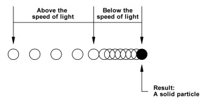

Fig. 26  
  
We therefore state that mass is but solidified energy. Sub-atomic particles vary greatly in size, but they are all created by nature in the same manner, and with the exception of size, weight, and configuration, they are identical. The scientific community speaks of different particles having different charges, but this is a mis-perception, or more precisely, a problem of mis-identification. There are very simple, logical reasons why that which is called an electron has a negative charge, while that which is called a proton has a positive charge, etc., but the explanation is beyond the scope of this paper, and will be discussed in depth in the segment dealing with atomic structure.  
  
**ANTI-MATTER**  
  
The universe in which we exist is falling in a given direction. The velocity of that fall is unknown except for relative motion, however, should the opposite direction be taken, at exactly the same velocity, the true velocity would then be zero. At absolute zero velocity energy becomes a zero factor, so that v = E, thereby, zero velocity equals zero energy. Mass will respond in a like manner - once again, velocity determines the value of energy contained in mass. With a zero value of energy, mass becomes very condensed.  
  
We will now add value to the zero velocity and say that our motion is now in the reciprocal direction. With an increase in velocity, energy is once more generated. Energy (due to motion) is now available, and the dense, compacted particles expand. The bodies are once again transducers, however, everything is reversed - energy is now being radiated from the former poles, while the plane of the leading edge of the fall accepts energy. The falling body is now a negative ion, and particles which orbit this falling body are charged in a positive direction. This universe (or galaxy, solar system, atom, etc.) at this point is what we can call anti-matter.  
  
As the velocity increases to and beyond the speed of light, we once again convert the mass to energy, and that energy is neutral - neutral, that is, in respect to itself. All that remains of that mass is a spiraling vortex of pure energy. More will be explained on this subject when we discuss the birth of a universe.  
  
**UNITY**  
  
We have shown that zero motion results in zero energy and in negligible amounts of mass, and that the direction of motion is all which separates matter from anti-matter. Also, we have shown the factors which will determine the amounts of energy or mass, and that everything happens at the rate of velocity squared. We are therefore working with direction (D), motion (m), velocity at the rate of its square (v2), energy (E), and mass (M). We can therefore state:  
  
D m v2 = E M  
  
Within this equation is encompassed all energy, mass, and forces. It is unity of all things. Mr. Albert Einstein, with his famous equation E = M, does not consider many factors of force, energy and mass. It is true that we may have energy without mass, or mass without energy, however, we also have conditions without mass or energy, and so E = M is simply not functional under all conditions. Mr. Einstein then extended his equation and stated E = M C2. This extension is functional, but only at the velocity of light or beyond. It does not take into consideration the many actions of energy and mass at velocities below the velocity of light. By the time his extended equation comes into play, much has already transpired which he has not accounted for. D m (v2) = E M accounts for all.  
  
**REVIEW OF FALLING BODIES**  
  
As we cross the threshold between falling bodies in general to atomic structure in particular, it is imperative the reader fully understands several major points. As stated in segment two (falling bodies) all bodies are in motion (i.e., falling), and all bodies fall through a given gravitational field. In the case of the Milky Way galaxy, the primary gravitational field is that of our universe. For planet Earth, the primary gravitational field is that of our sun. For our moon, the primary gravitational field through which it falls through is that of planet Earth (and so on). All bodies are attracted to the center of the primary gravitational field through which they fall.  
  
We've also previously explained that as a body falls it "radiates" a force of extracted energy along the leading edge of its fall, which causes the body to rotate in the direction of the extraction. This extracted energy is radiated in the form of bubbles, and the size of the bubble is relative to the size of the body from which it's been extracted. This extracted energy attempts to return to the body it's been extracted from, and in so doing creates the force generically termed gravity. This gravity offers a repulsive force to the gravitational field the body is falling through.  
  
All falling bodies are encased in an elongated shell which may also be seen as a bubble. This bubble represents the outermost reaches of the extracted energy, as illustrated in figure 27.  
  

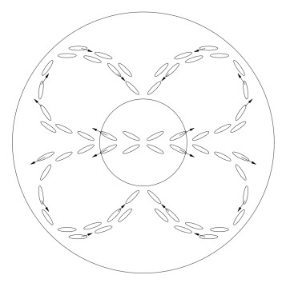

Fig. 27  
  
As can be seen, a particle or a body existing within that bubble is also a falling body. As shown in figure 28, falling body A produces field A, which attracts (pulls) body B towards body A.  
  

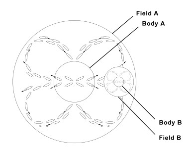

Fig. 28  
  
As this attraction is taking place, the field produced by body B repells the field of body A. The interaction between this attraction and repulsion of fields results in the orbit of body B around body A.  
  
To summarize then: the field which surrounds a falling body takes the form of an elongated bubble, and for any particle or body which exists within, or is forced into this bubble, the area of this bubble becomes its primary gravitational field. A falling body is always attracted to the center of the pirmary gravitational field through which it falls. At the same time, the force of extracted energy produced by the falling body is always repelled from the gravitational field through which it falls. An equilibrium is reached which constitutes an orbit. If the reader can understand these basic concepts, all else can be easily comprehended. Nature is not complex, unless we choose to make it so.  
  
**ATOMIC STRUCTURE**  
  
We will begin this discussion of atomic structure by considering what constitutes an electrical charge. If we observed a balanced atom we would find it had no charge, yet if we removed particles (electrons) from the balanced atom it would result in that atom having a positive charge. If we were instead to add electrons to that balanced atom, it would result in that atom now showing a negative charge. Therefore, an electrical charge (negative or positive) is the result of adding or subtracting particles from an atom. Since all falling bodies follow the same laws of nature (be that body subatomic, atomic, universal or anything in between) it is clear that a single particle cannot carry an electrical charge. When members of the scientific community extract so called particles with the aid of their accelerators and confidently proclaim these "particles" to be either negative, positive, or neutral in value, they have either confused their termonology, or have confused the issue, we're not sure which, but regardless, the fact remains that these charged "particles" are in reality systems of particles. If they weren't, they wouldn't be capable of carrying any charge whatever. Basic high school science courses teach that an electron is a very small particle which has a negative charge, but this is incorrect. What is perceived as an electron is actually a system of particles. It is perceived as carrying a negative charge due to its very small size relative to the nucleus it orbits. The bubble of extracted energy which surrounds an electron system is smaller than the bubble generated by the atomic nucleus, and so can be said to be negative in respect to the nucleus.  
  
The same proves true when dealing with "particles" from the nucleus of an atom. For example, scientists "smash" a nucleus and excitedly announce they've found mesons, which are supposedly particles similar to an electron except that they can carry negative, positive, or neutral charges, and are various sizes. Again, what they have found are not single particles, but are systems of particles. To our knowledge, science has yet to identify a single particle, and who could say if anyone would recognize it even if they did find one.  
  
Unity dictates that all bodies and systems follow the same basic rules, and so the arrangment and inner workings of sub-atomic systems can be compared to the falling body of our solar system. Our purpose is always to allow the reader to gain an understanding of physical law, so for the sake of clarity we will draw analogies between sub-atomic systems and our solar system, and will now focus attention on a simple electron system, which is comparable to the planet Mercury.  
  
When looking at Mercury we see its rotation and orbit are very fast compared to the more distant planets. Orbiting Mercury are small chunks of debris which are too small to be classified as moons per se, however, they perform the same function and serve to balance the system. A simple electron system behaves in much the same way in that its orbit and rotation are faster than more distant electron systems, while its size and the sizes of its orbiting bodies are also smaller than more distant electron systems. It must be remembered that each system of particles, no matter how simple or complex, produces a force of extracted energy that creates a gravitational field (bubble) which draws all particles (bodies) within its field toward its center. At the same time, the orbiting particles (bodies) generate their own fields (bubbles) which in turn repells the primary gravitational field through which they fall. A simple electron system is illustrated in figure 29.  
  

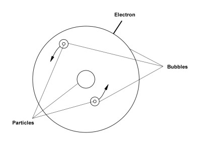

Fig. 29  
  
We could break this simple system down yet further, but at this time it would likely just cause confusion to the reader unnecessarily. For now it is enough to understand that the entire system is a series of bodies all generating their own gravitational fields, which are in turn encompassed by the larger field of the central body (or bodies). The simple electron is stable, has a fast, close orbit around the atomic nucleus, and is relatively small as compared to other electron systems. It should also be noted at this time that the outermost shell of the bubble generated by the central body (which we call a "mew") will be repulsed from any similar system which would draw near to it. It is this repulsive action which prevents all matter from collapsing in on itself.  
  
A complex electron system could be likened to the planet Jupiter with its many moons. A complex electron system, as shown in figure 30, is slower in both its rotation and its orbit as compared with a simple electron system, and will be found in the outermost orbits of the atom. Regardless of these differences, however, it operates on the same prinicples of attracton/repulsion as does a simple electron system, or any other system.  
  

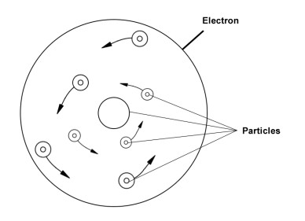

Fig. 30  
  
We haven't undertaken to name any of these particles, as it would be a vain exercise. The particles found in an electron system are the same type of bodies found in neutrons and protons, as will be seen in the next section. They differ in size and in their orbits, as do the planets in our solar system, but they all maintain their orbits due to the same interaction between the attraction/repulsion of their respective gravitational fields.  
  
**THE NUCLEUS**  
  
In its simplest form the average electron consists of twelve bodies (particles), while the average proton or neutron contains 22,000 bodies (particles). Each proton or neutron contain their own nucleus, and the bodies which orbit this nucleus are systems of particles, i.e., complete (but very small) electron systems. In turn, each nucleus of a proton or a neutron also consists of many systems of particles. The systems of the nucleus will become more clear when we begin our discussion of our solar system nucleus, the sun. Since its very difficult to diagram such a complex system without computer aid, we ask that the reader visualize our solar system as one large proton (or neutron), and let the sun serve as a model for the proton nucleus. Don't let this seeming contradiction confuse you - the proton nucleus is not a single body and neither is the sun, rather, it is a multi-bodied system, but more of that later on. Orbiting the proton in the same way as the planets orbit the sun are systems of bodies - some simple as the systems of the minor planets, and some more complex as are the systems of the major planets (Jupiter, Saturn, etc.). It must be remembered that orbiting around all of the moons of the planets, especially those of the major planets, are chunks of debris which in turn balance each moon into separate balanced systems, and orbiting these chunks of debris are rocks and smaller pieces of debris which in turn balance these mini systems, and so on. This is admittedly a very sketchy description of a proton (neutron) but all of the systems in nature are so very repetitious that there seems to be little point in weighing down this paper and risking boring the reader with constant repetitions. Suffice it to say that if the reader can in their mind visualize systems of particles orbiting larger systems, which in turn orbit yet larger systems (and so on and so on) all orbiting a central nucleus which is but another system of systems, they will have a fair understanding of the sturcture of the "simple" proton (or neutron). All of these systems exist and are in motion, undetected, within the gravitational field of the proton/neutron.  
  
As we have already strongly implied, the structure of a neutron is identical to that of a proton except for the presence of one major system of particles. As discussed earlier, an electrical charge is created by either adding or subtracting particles from an atom, and the same is true for the miniatoms which are called protons and neutrons. The neutron is analogous to a balanced atom, and is neutral in value. The proton carries a positive charge because it is missing a system of particles which would allow it to balance. One the outermost edge of the bubble (i.e., the mew) which surrounds the neutron orbits a relatively large, slow moving system of particles which serve to balance the neutron, allowing it a neutral charge. This system, which we refer to as the jipsee system, not only determines whether a nucleus system will be a neutron or a proton, but is also largely responsible for the structuring of the atom. The jipsee is able to pass readily from a neutron to a proton due to its low velocity and distant orbit and it does so regularly, in an attempt to electrically neutralize (balance) a proton system. When it moves from a neutron to a proton it succeeds in balancing the proton system by "changing" it into a neutron system, but in the process leaves its former system with a lack of balance and a positive charge. It is the continuous cycle of the jipsee which tends to hold the proton and neutron systems together in the atomic nucleus, and indeed, it is the the counterpart of the jipsee system which, on a larger scale, holds the key to the creation of the elements, but a detailed explanation of this is beyond the scope of this paper and will be dealt with in the future.  
  
In continuing the discussion of the sub-atomic realm we would point out that all systems within an atom (and all atoms) display an isotopic effect, however, the instability varies with each system - some exhibt a strong isotopic effect while in other systems it is hardly detectable - i.e., the lack of stability is a matter of degree. The highly isotopic system stabalizes itself by inner-facing with other isotopic systems. It is the jipsee system which once again travels from system to system attempting to create a balance. In extremely unstable systems the jipsee is in constant and rapid interchange, and it is this continuous and rapid movement of the jipsee between other systems which holds the various systems together as a unit. For clarity, always bear in mind that these jipsies can be any size, and so perform their balancing act on every level - from the smallest possible sub-atomic system to the galactic level systems.  
  
The sub-atomic/atomic jipsee system has another interesting effect when we consider a true wanderer, i.e., a non-aligned system not in orbit around a larger system of bodies. It is a stable system, and could be visualized as an autonomous micro-atom – it is truly a free agent. Like all falling bodies it is in motion at a given velocity, and has an energy exchange which determines pole values. When, in its travels it encounters a slower moving system (or group of systems) the interaction between the pole placements of the respective systems, coupled with the interaction of the attractive/repulsive forces of the jipsee system and system x, can and often does affect the degree of tilt experienced by the bodies and/or system functioning within the jipsee and/or system x. Depending upon the exact circumstances of the encounter (i.e., the respective sizes, velocities, direction of motion, pole positions, etc., etc.,) the result could range from a mild shock to one or both systems, to a major upheaval of both systems - there are literally thousands of possible scenarios. These free agent jipsee systems have their counterpart on the galactic level, so we will explore some of the possible scenarios more fully in a supplement dealing with the workings of the sun and the solar system, which will follow in the near future. In this discussion, however, without the aid of computer graphics, there is little point in attempting to illustrate the "average" encounter at the atomic/sub-atomic level. Indeed, though the many actions of this particular system of particles are facinating in the vital functions they perform, we included it in this highly condensed paper primarily to introduce the reader to the concept, and because it is important to the discussion of why some elements can be magnetized while others cannot, and why some elements are radioactive.  
  
A brief sketch is all the explanation this paper will allow, but even this should allow the reader to begin to visualize the actions of the jipsee in the sub-atomic world. Once a foundation of logic is established, our elaboration on the subject in a supplement to follow will be more quickly and easily comprehended.  
  
We'll begin with a short explanation of radioactivity, which is not caused by the weak nuclear force - that enigmatic force which no one can seem to define. Rather, it is caused by the actions of the jipsee systems, which in their never ending effort to create balanced systems, actually throws out particles from highly unstable systems. This free agent, the jipsee, moves around the systems of the unstable atom, and repulses unstable systems with such a force that the atom is perceived to be "shedding" its systems. In fact, the actions of the jipsee in this high velocity atom are so energetic that it in effect tosses these systems out of the gravitational field of the atom. Any system or system of systems (atoms) can be made radioactive if their functions and normal balances are disrupted. Once a disruption has occurred, the jipsee systems quickly begin to throw out the chaotic systems, and the atom is now potentially lethal - because it is emitting the very same particles and systems which are released through the walls of the containment vessels. For the time being, this abbreviated explanation will have to suffice.  
  
Now we will briefly discuss magnetism, and will consider the element iron. Due to the great strength of the repulsive forces generated by the many systems within an atom of iron, it is unaffected by the jipsee systems, and in fact this is a case where it is the jipsee system only which experiences disruptions and upheavals in the close encounter. Because of this strong repulsive force (the many reasons for which will be explained in detail in the future) and the relatively unique, symmetrical arrangement of the systems contained in all iron atoms, and the resulting symmetry of the atoms themselves, a current passing through the atom will experience an additive effect. The arrangement of some of the systems in a hypothetical atom of iron are illustrated in figure 31.  
  

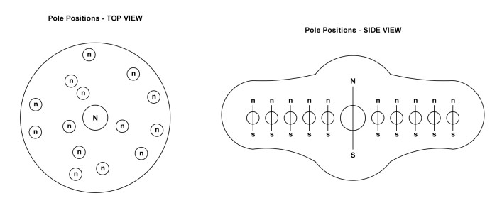

Fig. 31  
Atom Of Iron  
  
In an element such as gold, the repulsive forces of the various systems within the atom are relatively weak (as compared to iron) and so the jipsee systems have a great effect on these systems, and regularly alter their degree of tilt as they encounter these systems in their travels. A hypothetical and greatly simplified atom of gold is illustrated below.  
  

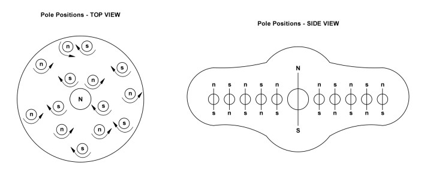

Fig. 32  
Atom Of Gold  
  
When a current is introduced to the element iron, all of the systems "flip" over, but as can be seen in figure 31, they will still be arranged symmetrically in respect to each other, and so an additive effect is experienced. When the systems in the element gold "flip", however, they remain, in effect, asymmetrical in respect to the other systems within that atom of gold, and so do not experience the additive effect when current is applied. We could go into very find details on this subject, but it is the consensus of our research team that this is not the most vital subject matter at this time. In fact, with the severe problems faced by our planet and its inhabitants today, magnetism seems almost trivial, and so will be expanded on in the future, after the more vital subjects have been fully addressed.  
  
**CONSEQUENCES OF NUCLEAR ENERGY**  
  
As explained earlier, the energies generated by a body in motion are extracted in the form of bubbles of energy which are neutral in respect to the other bubbles extracted from the same body, however, the size of the bubbles are directly proportional to the size of the body from which they've been extracted. This means that the larger bodies produce larger bubbles, and so we can place values on these bubbles and say that some bubbles are negative in respect to bubbles produced by other bodies, i.e., they are smaller. By the same method we can say that some bubbles are positive in respect to bubbles produced by other bodies, i.e., they are larger. This terminology is very important for the reader to understand, so that the information you've received will be easily understood. It is vital that the people who read these pages come to see the larger picture. It's not just the ionosphere that's in danger - it is all of the combined systems of the earth altering their normally balanced cycles. The entire planet earth is at risk in this crisis, so it's imperative that the reader comprehends the way in which the various systems interweave and how they are therefore all out of balance, and it will take a major effort to put these cycles back into a proper balance. Once the processes are understood, the true magnitude of the problem becomes apparent.  
  
During the process of fission, a neutron is hurdled at the nucleus of a uranium (or plutonium) atom and it divides that mass. In this process neutrons and protons are destroyed and their energies released. After studying falling bodies and atomic structure it should be apparent that these enormous amounts of energy released in fission are the result of the many systems of particles within the neutron or proton being forced out of their orbits and turned loose into the environment in a highly unstable state. Also, it should be clear that many of these systems are completely destroyed, leaving only highly energetic, very minute particles moving at incredible velocities. These particles and very minute, unstable systems move off in all directions - some to pass through water to create steam, some down into the core of the earth, and some straight through the walls of the containment vessels and into the atmosphere.  
  
SUMMARY  
  
Particle physicists detect only the bubble of the electron system and believe it to be a single particle, but in fact, a single complex electron system may contain as many as twenty-two single particles, and so it's easy to see why our modern physicists are in constant and confused disagreement with each other. This confusion among the scientific community is perhaps the most difficult problem we've had to overcome in formulating unity. A classic example of this confusion is the application of the mechanics of quantum physics, wherein an electron traveling at a velocity beyond the speed of light is seen as a photon of energy and is called a Beta-ray. Other areas of applied theoretical mathematics view the electron as a solid particle. This is confusing because both applications are correct, but they have attached different names to the same unit. Just trying to sort out this type of jumbled terminology so that we could evaluate their test results was a momentous task, but when we did, it became very clear that they were dealing with the same unit at different velocities. Apply the equation D m v2 = E M, and you will quickly see that an electron system traveling at the velocity of light or beyond becomes what is seen as a photon, while an electron system traveling at velocities less than that of light becomes what is seen as a solid particle. The unity equation is valid for all bodies, and it's not complex, once we recognize that there is much confusion in the current community of scientists. We must rely on the facts, and forget about all of this fancy guesswork before we "guess" our way into oblivion.  
  
In each and every fission reaction, approximately twenty protons and neutrons are shattered, the exact number depends upon the type of material being used. The average proton or neutron contains approximately twenty-two thousand particles, so do some math and you'll quickly see how many trillions of these unstable particles and systems are being forcefully introduced into our eco-system per micro-second, worldwide.  
  
We earlier carefully explained that any unstable system will immediately attempt to balance itself, and for many of these newly destabilized particles and systems this attempt begins as they pass through the walls of the containment vessels. Here again the jipsee systems are a major factor, for as these minute particles and systems of particles stream through the walls they are already in the process of re-assimilation into larger, more balanced systems. While engaged in this process, the jipsee systems in the atoms which form the containment vessel walls are very strongly attracted to these highly unstable systems, and often leave their orbits to assemble and attempt to balance these very unstable systems and particles. This means that from the moment a nuclear plant begins operations, the walls of the containment vessels begin to weaken so that as time passes they also become unstable and allow ever larger and larger systems and particles to escape unopposed.  
  
To briefly address the question of where these particles and systems go once beyond the containment walls, we would begin by considering those which travel inward - towards the core of the earth. In the segment on falling bodies we discussed the cycle of energy exchange experienced by a body in motion, and stated that under normal conditions the rate of extraction is balanced with the rate of energy input (at the poles) and that this cycle is tied directly to the velocity and rotational rate of the body. If the reader understands this cycle they will also be able to clearly see that as these particles move into the core, they are disrupting this normally balanced cycle. More input energy, no matter the source of input, forces the planet to generate more extracted energy to attempt to compensate. The rate of the extraction directly affects the rate of the rotation, so as the energy extraction becomes progressively accelerated, the rotation rate will follow suit. As the cycle completes itself and the extra energy extracted now returns as input energy (approx. 10-12 years), this extra level of input, combined with the continuous additional input energy from nuclear fission ensures that the problem will continue to be progressive.  
  
We estimate that 15% of the extra energy forced into the cycle by the use of nuclear fission remains in a state which is negative in respect to the normal energy output of this planet, and though this percent of negativity has its undesirable effects, it is the increased rate of energy exchange which most concerns us now. As should be apparent to the reader at this point, an increased rate of energy exchange and rate of rotation will cause an increase in the repulsive force exerted by the falling body. As the repulsive force increases the body moves farther away from its nucleus, which in our case is the sun. If the orbit of this planet expands, it cannot help but affect the orbits of the other planets in the system, particularly our closest neighbors.  
  
Of the many highly energetic particles and systems released through fission, many travel toward the moon, and because the moon and its extracted energy are very negative in respect to planet earth, some of these energetic, still unstable particles and systems are readily accepted by the moon as input energy. This will increase the cycle of energy exchange in the moon, once again resulting in a greater repulsive force generated by that body. Clearly, the moon cannot fail to move farther away from the earth. The tides, (which are erroneously said to be caused by the gravity of the moon "pulling" at earth) are becoming ever more severe, but this is only the beginning. As the repulsive forces of earth and moon continue to increase, the interaction between them (which is the reason for the earth tides) will cause the tidal cycles to become increasingly dangerous to coastal dwellers. This new balance of interactions between the respective fields of earth and moon will also increase the degree of earth wobble, but the position and field of the sun is also a major factor in this equation, and so will be considered after solar structure has been fully addressed.  
  
When we further consider where these particles and systems go, we must mention that some of the smallest and most energetic move straight out of the earth's gravitational field and speed toward the sun. Clearly, these systems are very highly negative in respect to the sun, and are repelled at incredible velocities back toward the earth/moon system. It is known that particles of energy from the cosmos travel in vortexes, yet experimenters deep in the earth (searching for proton decay) are picking up readings of energies coming into the earth in a straight line. They are speculating these are from some galaxy out there, but in reality they are detecting these high speed particles now repelled and much accelerated, returning to haunt us all, and disrupt yet more earth cycles.  
  
The great majority of the particles and systems under consideration here find a home in the upper reaches of the ionosphere. It must be remembered that these systems and particles of which we speak are various sizes and moving at various velocities, but are all very negative in respect to earth. Some of the faster moving particles and systems have converted to photons of energy (bubbles) and when they collide with the normal ozone (O3) they quickly break it down into its singular element (O). The single oxygen atom is an electrical isotope, and so carries a positive charge, and will readily assimilate with any element, particle, or system of particles that are available. At the same time as these events are occuring the slower moving particles and systems are attempting to restabilize, and are reforming into more complex, balanced systems. They come together at such a high velocity (but less than that of light) that the newly assembled neutrons are not neutral, but are slightly negative. These negative neutrons quickly seek out proton systems, and often form into nuclei systems before the proton is completely assembled, i.e., while it still has a higher than ideal charge. Our calculations indicate that the average newly created but mutated nuclei system would consist of two slightly negative neutrons and one proton. Because of this instability, the various jipsee systems are very active trying to achieve order, and in the process begins throwing off systems and particles. If these were normal nuclei systems we would have a hydrogen atom, but they are not normal - they are highly unstable (radio-active) isotope of hydrogen, and an investigation of this new element will reveal it has an atomic weight nearly that of helium. Being much larger than the normal hydrogen nuclei, they will also attract more and larger electron systems than would normal hydrogen.  
  
Some of these newly formed, strange elements are forming into molecules with the single oxygen atoms available, creating an abnormal variation of (H3)2O, which will eventually return to earth as radio-active rain. This, much more than acid rain (which is also a factor) is taking its toll on the plant life of earth. Others of these singular elements of oxygen are directly receiving the single particles released through fission. Once residing in the oxygen nucleus they attempt to stabilize by gathering more stray particles and building new larger and larger systems within the nucleus. Eventually this process produces new proton and neutron systems which find stability as fluorine. Other chemical reactions will also result in formation of these fluorine atoms, which are able to very readily divide existing O3 molecules into their singular elements, thus perpetuating the abnormal cycle. Here again, a problem which was serious enough becomes progressively more dangerous.  
  
Due to various factors, many of the trillions of particles released through fission do not immediately assimilate into larger systems, and these, being highly negative to earth and even more negative in respect to the sun, tend to "settle in" near areas which are away from direct contact with the sun's energy. On earth this means that they will prefer to settle in near the pole which lies in darkness at the moment. Here they assemble themselves, but now, without the impedance of the full strength of the sun's repulsive force, the result is a very negative plasma. When the sun again returns to whichever pole is involved, the surface of the earth below is warmed. The air is lighter, and the lighter elements and molecules of the ionosphere begin to move earthward in massive quantities. The very negative plasma is, of course, more highly negative to the sun than the earth, and therefore when it is brought into contact with the sun's greater repulsive force, it is forced earthward. The final result of this movement is a large "crack" in the ionosphere which will begin to open as soon as the area in question begins its summer. It will reach its height during the mid-summer, and will begin to close only when the sun again leaves the area in darkness, allowing the negative plasma to be repelled from earth back into the ionosphere. These polar ionospheric "cracks" will continue to grow progressively larger each year until actions are taken to restore balance.  
  
These cracks in the ionosphere are serious enough, but once more we find there are other factors which compound the problem. In this case it is the tendency of these particles to be attracted to areas where there are large deposits of ferrous metals below, and here they assemble into negative plasma. They will be most strongly attracted to any of these areas which are surrounded by water. This is a symptom which we hadn't expected to see manifested until 1987, or perhaps even 1988, but evidently there are multitudes more unstable particles being released through nuclear weapons tests, faulty reactors, and radio-active wastes than anyone is aware of, because now its been reported that a hole has developed over Norway. If this is indeed the case, then be assurred - there are others. Many of them will be found to have developed over the oceans and seas, where ferrous metals lie beneath the ocean/sea floor. All life below these holes in the ionosphere are at extreme risk, so these areas must be identified - and quickly.  
  
Some of the effects of the massive disruption of the systems on earth have been stated earlier - others have not - but the reader should clearly see what their future holds, so some of these things bear repetition. The ill effects felt by the planet earth will manifest themselves in progressively more violent reactions. Perhaps the most serious of these will be a direct result of the increased rate of energy exchange. Already this is causing a steady increase in the internal pressure of the planet, which will be periodically (and increasingly regularly) relieved through earthquakes and volcanic actions. This pressure will create more heat within the earth which will (or already is) cause the surface of the planet to warm, and the ice caps to begin to melt. Besides contributing to an increase in ocean levels, this warming will also cause disrupted and abnormal weather patterns which, coupled with the increasingly severe tidal cycles, will cause coastal areas to disappear.  
  
As the energy exchange of the planet increases, the magnetic field of earth will continue to change. This will increasingly affect the many different species of life which rely on the magnetic field for their sense of direction, and it is quite possible that some species of whales are already experiencing difficulties in navigation. Oceanic species sensitive to changing water temperatures will begin to experience shock due to rising water temperatures. Those that cannot quickly adapt will die, while mobile species will be forced to migrate to cooler waters. This will overtax the ecosystems, and many of these creatures will also die.  
  
Land based species face other dangers. We have shown an outline of atomic structure, as well as some of the effects these fission-freed particles and systems can have on atomic structures. Now we would remind the reader that each and every cell, and every molecule of DNA in their body is but a conglomeration of atoms which are subject to the same laws - and the same injuries - as are all other atoms. Unlike the sun, our bodies generate no strong repulsive force to ward off these high velocity, unstable particles and systems, and we are even less dense than a containment vessel, and so offer no barrier to these fission released systems. As they move through a body they continue to attempt to stabilize, which means they will either try to join existing systems, carry off jipsee systems as they pass through, or in cases where their velocities are too high to allow either of these options, will simply displace and disrupt systems they encounter. For humans and other species living in close proximity to a nuclear reactor the odds of developing a fatal disease are vastly increased - for the immune system will be unable to function under conditions of constant disruptions. These people will also show a higher incidence of genetic defects among their offspring - some obvious (blindness), and others hidden (immune system deficiencies, etc.). Since the brain also operates with these same bubbles of neutral energy we've taken pains to explain, its functions can be easily disrupted by introduction of foreign bubbles and particles, causing ever increasing crime and accident rates in areas of high doses, as well as insanity, suicidal behavior, and even brain damage. Always remember that nothing short of the repulsive action of the sun will stop or deflect these unstable systems and particles, so we are all completely at their mercy - every day - and so is every other living creature on this planet.  
  
There is so very much more to be said, but the time element is so critical that this will have to suffice for the time being. These past months our research team has worked frantically to sound the alarm, and our focus has been on anti-nuclear, environmental, peace, and disarmament groups and outspoken individuals but the response rate has been very discouraging, until just recently. Our first round of mailings were very poorly received, and it's possible that the reason for this was that we stated confidently that if this insanity continued, we could set off a chain reaction which could split this planet, the solar system, and perhaps even the galaxy and universe. Perhaps this was viewed as too impossible to be true; we can't know for certain what caused the apathetic attitude towards our warning, but it doesn't matter now. All that does matter is that we are not joking, and we were not exaggerating. The total and instantaneous destruction of this planet is not only a possibility - it is an eventual absolute certainty, and we will now explain why.  
  
In the same manner as other new atoms are forming in the ionosphere from the particles released through fission, so are H, H2 (deuterium), and H3 (tritium) being produced in large quantities, and with each passing minute, more and more are accumulating. If anyone doubts the truth of this statement, then find a way to take samples, and prove it to yourself - the element is there, and in great quantities. Now recall that in 1956 Dr. Luis Alvarez and his team produced cold fusion in their University of California radiation laboratory. The fusion was between light hydrogen (H) and heavy hydrogen (H2), and it was accomplished by passing a cosmic ray through cold hydrogen. It is a commonly known fact that H2 and H3 very easily fuse. A cosmic ray is nothing more than a negatively charged mu meson, which our team has determined is a very small, high velocity jipsee system. Tests have proven that hydrogen can be fused by the impact of these high velocity particles and systems, which we have explained are in great abundance - as is hydrogen - and all caused by fission. When a high velocity jipsee system (cosmic ray) impacts with hydrogen in such a way as to cause a single fusion in the ionosphere, the entire planet can be engulfed in a huge hydrogen explosion from which there will be no survivors. When this happens (and we say "when" because it's only a matter of time before it does) the resulting explosion will immediately engulf the moon as well. With the destruction of the repulsive fields of earth and moon, they will immediately begin their plunge into the nucleus of our solar system. This in turn will cause the fission of our nucleus, the sun, which will then become a giant pulsar.  
  
Our calculations are not yet complete, but preliminary indications are that the sudden and massive disruption of this solar system could quite possibly set off a chain reaction which we cannot predict the boundary of.  
  
In coping with the dangers which threaten, several emergency steps must be taken immediately, and the most urgent of these are a complete ban on all weapons testing worldwide, and a total shutdown of all nuclear reactors. This must be done forthwith, as these are the most likely means of igniting the ionosphere. From there on the strategy is clear - we must begin to repair the damage. The technology now exists which will allow these repairs but we must have allies, for alone we can do nothing! It is time for the people of this planet to join together and work together on the common goals. The responsibility has fallen to us, and we must not fail. Our only hope is to begin a worldwide, coordinated effort, for if we don't, our future is assured. We can no longer sit back, lulled by the false belief that our trusted institutions will "fix" it, because they won't, or they already would have begun. It seems clear that the Soviet Union is well aware of the real possibility of fusing the ionosphere at any moment, and they have reacted by stopping all nuclear testing and are literally begging the United States to do the same. They have warned that this nation's pursuit of "Star Wars" testing could set off a fire which would engulf the earth, and are pleading that this country abandon these goals. Their fears are very well founded - this is not some political game they're playing! If you've studied our preliminary work it should be obvious to you that perhaps the worst thing this country can do is to be shooting high energy beams through our highly unstable ionosphere, yet they persist. If the Soviet Union is aware of the immediate danger, then is it possible that the United States is not? Form your own conclusions, and then consider that perhaps it is time we asked the Soviet people just what they have found out about the status of this planet. If we the people cannot find a way to work together when every form of life on this planet is facing certain death, then we must ask ourselves if such a species is worth saving.  
  
A small generator was built and tested, and we can produce the repulsive force. The theory is correct, and the technologies which will allow us to save ourselves waits to be developed. If you harbor doubts about the truth of what we assert, then we invite you to do everything in your power to prove us wrong. In the process you will become convinced that we are correct, and at that point we will very much welcome your participation in Project Stardust. It's time to take a stand!

Previous: [The Theory of Falling Bodies I](1__falling_bodies_pt1.md)
Next: [Unity of All Things](2__unity_of_all_things.md)
