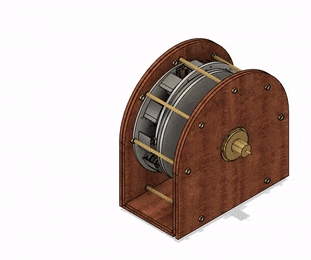

# Lloyd B. Zirbes: Project Stardust  
## The Behavior Of Free Bodies In Space
(a work in progress, as more materials are found they will be added here for posterity. If you have any materials not already included, please join [the discussion page](https://github.com/LloydBZirbes/docs/discussions/1) )

As noted by Lloyd himself: "Reproduction and distribution of this material is vigorously requested and encouraged."

## -- [Introduction]
## 01 [Old Math](OldMath_NewMath.html)
## 02 [New Math ](OldMath_NewMath.html)
## 03 [Tests and Results of Falling Bodies](1__falling_bodies_pt1.md)
## 04 [Introduction to Theory and Unity of All Things](2__unity_of_all_things.md)
## 05 [Energy to Mass Conversion]
## 06 [Anti-Matter and Review of Falling Bodies]
## 07 [The Structure of An Atom]
## 08 [Consequences of Nuclear Energy](2a__consequences_of_nuclear_energy.md)
## 09 [The Structure of the Sun](3__solar_research.md)
## 10 [The Theory of Falling Bodies II](4__falling_bodies_pt2.md)
## 11 [Beyond the Ionosphere](5__supplement1.md)
## S-1 [Three Page Article on the Van Allen Radiation Belt]
## S-4 [Appendix of Related Articles]
            [Global Warming and Ozone Depletion]
            [5th and 6th Forces]
            [The Sun]
            [Contradictions in Modern Physics]

## 12 [Supplement 2: Nuclear Energy vs. Planet Earth ](6__supplement2.md)
## 13 [Letter: 3rd March 1987, Talmadge, Purdue U. ](lettertoTalmadge.html)

# the Zirbes motor and Blueprints

Lloyd Zirbes released and had distributed, through an agent, a set of blueprints for an "efficient motor". Those blueprints are available below in PDF or in Tiff.
### [Blueprints](original/blueprints) [PDF](https://github.com/LloydBZirbes/docs/tree/main/original/blueprints/pdf-version) / [Tiff](https://github.com/LloydBZirbes/docs/tree/main/original/blueprints/tiff-format)
### [Prototypes](original/prototypes)

# Published in Fulcrum Magazine (October 1996)

Lloyd Zirbes' "Old World Math — New World Math" and his letter to Carrick Talmadge (Purdue University, March 3, 1987) were published in **Fulcrum** magazine, Volume 4, Number 3, October 1996 (pp. 11–14). Fulcrum was the quarterly journal of the University of Science and Philosophy (USP), founded by Walter and Lao Russell in Swannanoa, Virginia, published 1992–1998.

Editor Dr. Timothy A. Binder introduced Zirbes' work in the Q&A section (pp. 2–5), connecting it to Walter Russell's cosmogony and to Prof. Felix Ehrenhaft's magnetic ion experiments. Binder wrote: "Zirbes' tests reveal that different masses fall with different rates of speed even if they are not magnetically or electrically charged," and endorsed the findings as compatible with Russell's two-way gravity framework. In the follow-up issue (V5N1, May 1997), Binder and Larry Tiegs discussed G=mv² further in the context of Russell's physics.

- [Binder's editorial commentary connecting Zirbes to Russell](fulcrum-v4n3-binder-commentary.md)
- [Fulcrum V4N3 PDF pages — Binder Q&A (pp. 2–5) + Zirbes articles (pp. 11–14)](original/fulcrum-v4n3-zirbes-pages.pdf)

# Archival
This project is being backed-up to the [Github Archival Program](https://archiveprogram.github.com/faq/)

# Contact, Contribution
Want to contribute? Have information to add? Please make a Github account and join [the discussion page](https://github.com/LloydBZirbes/docs/discussions/1)

