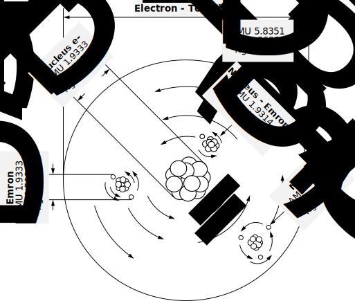

# The Electron and Fine Particles — Additional Chapters

**Author:** Lloyd B. Zirbes
**Source:** Original manuscript, from Jen Brannstrom / LloydBZirbes repo
**Scans:** https://photos.app.goo.gl/bNt1D4zG14YAoWkC7
**Vector drawings:** `original/electron-theory-vectors/` (Zirbes_electron-drawing01.svg through 14.svg, plus 07A and 07B)

---

## The Electron and Fine Particles

The electron (e-) has an atomic mass unit value of 5.49x10-4, with a kilogram (kg) weight of 9.1329x10-31. The electron contains 2.705x107 infinitesimal fine particles.

The infinitesimal prime particle has an atomic mass unit value of 2.0333x10-11 which converts to a kilogram value of 3.763x10-38.

The electron is not stable, therefore, .000549 (5.49x10-4) is merely a point of reference.

In the following pages I will very roughly break down the electron into its separate parts. The particles of the electron, like the electron itself, are not stable.

Subatomic particles, like atoms themselves, are in a continuous mode of decay and assembly, therefore, it becomes difficult to accurately express particles or atoms in mathematical terms, therefore,a given margin must be allowed for uncertainty factors. It would be well to keep in mind that at times we are dealing with time factors that may be as short as two billionths of a sec. My findings clearly indicate that electrons do not change or jump orbits as believed by the great learnith ones. I find the orbits of the electrons are in general, quite stable, like the planets around our nucleus, the star called sun. However, my findings also most clearly show that the energy (fine particles) surrounding the electron does change orbit; In other words the energy from a heavily charged electron will jump to a lesser charged electron which may be in a different orbit. All electrons are negative in value, however, as an electron gains in energy value, it not only increases its value in atomic mass units, it also has a greater negative charge.

As these negative values increase, it becomes far more negative than a smaller sister electron, the smaller electron, although negative in value, is by far less negative than the larger electron. Therefore, the smaller electron is seen by the larger electron as a positive charge and in respect to each other, the smaller electron is a positive charge, therefore, the highly charged (the large one) electron discharges its energy to the small and positively charged electron.

In general, this discharge moves from the electron with the closest to the nucleus orbit to the electrons that have greater orbits. In other words, the energy moves from the nucleus outward. Now, under certain circumstances as the energy moves (or jumps) to another electron, a small amount of energy is emitted, this excess energy was first called a photon and then a quota, from this release of excess energy come the bases for quadrant physics. This photon is the result of a "heavy" electron discharging to a "lighter" electron that contains a small amount of energy, therefore, it can not accept the entire charge of the discharge, that which remains is thrown out or in otherwards, emitted from the atom. That emitted energy is a photon.

Should (when) an outer orbiting electron becomes too heavy, it will slow its speed (negative velocity) and then break its bounds with the nucleus, it now will be emitted from the atom, at which time it can be detected and is called a beta ray (B-), under different circumstances the electron is also called a gamma ray and also a neutrino.

Now, the energy of the electrons originates from the nucleus.

All atoms and their isotopes decay. Some atoms decay in less than a second, yet other atoms maintain themselves for tens of thousands of years. Nevertheless, they all decay! As a short-lived atom or isotope decays, extremely large particles can be detected, such as electrons, positrons, protons, neutrons, and even alpha particles (helium ion).

As an atom slowly decays, bits and pieces break away from the positrons and pions, the pions are energy that is held by the neutron. These bits and pieces are energy that is emitted by the nucleus and is then picked up or collected by the close orbiting electrons, the electron energy continues on. Even the most stabilized atom will occasionally emit a heavy beta ray (B-)

There is a wide range, a very wide range (spectrum) in the atomic mass unit value and the kilogram value of sub-atomic particles.

However, particles appear to stabilize in units of three.

Thereby: 3 - 9 - 27- 81 - 243 - 729 - 2187 - 6561 - 19683 - 59049 - 177147 - 5.3142x105 -1.5943x106 - etc. etc., you will find these values stand out in the chart on fine particles.

It is well to keep in mind that a given value may be true for a mere split second, and then will change.

---

## Electron Values

Now; the atomic mass unit value of a rather large electron (e) is .000549 (5.49x104), this is the accepted value. However, a more stable electron, including its constituent particles, has an atomic mass unit value of 5.8351x10-4.

We will identify this as electron number two, which contains 2.8698x10+7 prime particles and has a kilogram weight of 9.6892x10-31.

We then have electron number three, with an atomic mass unit value of 2.9176x10-4 and contains 1.4349x10+7 prime particles with a kilogram weight of 4.8447x10-31. E-No./3 is found in the closest orbit around the nucleus, it will easily and quickly accept energy discharge from the nucleus and then pass it on to the next electron.

I have indicators that allow me to believe that electron number three is an accumulation of fine mass particles that have been emitted from the nucleus.

Having said all of that, then I must continue on and speak of electron number one.

Electron number one is large, highly energized and slow moving. It is found in the outermost orbit of the atom and is about to be emitted (kicked out) from the atom. At the instant that it is emitted, it will lose a small value of weight. The electron emission will be detected and referred to as a beta particle, also detected is one or more clouds of energy which are called photons.

Electron number one, while still in orbit has an atomic mass unit value of 8.7527x10-4 and contains 4.3047x10+7 prime particles which has a kilogram value of 1.4534x10-30.

It is a generalized belief that an electron is a firm particle of mass. However, an electron has a tendency to decay into three parts and at the same time yet other decays are resembling larger particles.

It is most frustrating to mathematically probe a particle which leads to three different ball fields and then discover that particles from yet other ball parks are assembling and developing into the same particle that you originally began to probe. Funny things happen in the realm of particle studies.

The electron has some of the same dynamics as a photon in the sense that the electron, like the photon will at times act corpuscles and the next second, acts like a wave, of course, this is due to the size of the particle and its velocity.

---

## The Electron as a Miniature Solar System

It is common knowledge, that a photon is energy that has been released from the electron, what is not known is that the electron is like a miniature solar system! Quite in the likeness of an atom, the electron has a multi-bodied nucleus, just like an atom or our nucleus, a star we call sun. The electron has particles that orbit its nucleus, in the same manner that particles orbit the nucleus of an atom or planets orbit the sun, these particles are called emrons.

The emrons, in turn, have particles orbiting them, these particles are called merons. Merons orbit the emrons in the same likeness of moons orbiting the planets. From this point, you must study the following drawing and then continuously refer back to it. Please see drawing number 1.

For drawing number one, I have selected an electron with an atomic mass unit value of 5.8351-4, this electron contains 2.8698+7 prime particles and has a Kilogram weight of 9.6892-31.

99.9 per cent of the mass of an atom is contained in the nucleus, in a like manner. 99.9 per cent of all the mass in our solar system can be found in the nucleus which is the star we call the sun.

In exactly the same manner, 99.9 per cent of the mass contained in the electron is located in its nucleus!

The nucleus of the electron, as shown in drawing number one has an atomic mass unit value of 5.8293-4 and contains 2.8669+7 prime particles with a kilogram weight of 9.6795-31.

Before we move on to electron energies, which are called emrons and merons, I would want to make a few more comments regarding the electron. With my many years work on the bench and untold numbers of experiments, I have found the electron has a pole value.

I have found a prominent pole value on the electron which is a South Pole which is positive in value, this was discovered with my extensive work with emrons and merons.

It is much more than probable that an atom has a compound spin, giving the false impression that the atom is orbited by the electron in a polar orbit. Nature is not complicated!! Nature is very simple, and so beautifully repetitious. Should you form a mind picture of our solar system and should you wish to have a mind picture of atoms & sub-atomic particles, then take the mind picture of our solar system and make it smaller and smaller and smaller, you will then have a mind picture of the microcosm. Should you now form the same mind picture of our solar system and then make it larger and larger and larger and larger and keep enlarging into infinity, you will then have a very accurate mind picture of the macrocosm!!

---

## Emrons and Merons

Now, back to the energy of the electron, which is named emrons and merons.

However, at all times you must keep in mind that energy is mass, therefore, mass is energy, that which determines there state of existence, be it energy or mass, is velocity.

So when I say; energy of the electron, or atomic energy, I could just as well say mass!

Emrons orbit the nucleus of the electron, there appears to be three emrons in orbit around the nucleus. The sum total atomic mass unit value of the enrons is 5.800-7 and they contain 2.8525+4 prime particles which has a kilogram weight of 9.6309-34.

The average, single emon has a atomic mass unit value of 1.9333-7 and contains 9.5084+3 prime particles with a kilogram weight of 3.2103-34. Enrons (like all particles) tend to stabilize at various values. The heaviest emron, which we may call emron number one (el), has a atomic mass unit value of 9.7252+5, it contains 4.783+6 prime particles and has a weight in kilograms of 1.6149-31.

Enron number two (e2) has a atomic mass unit value of 3.2417-5, contains 1.5943+6 prime particles with a kilogram weight of 5.3829-32.

Emron number three (e3) has a atomic mass unit value of 1.0806-5 and contains 5.3144+5 prime particles with a kilogram value of 1.7943-32.

Emron number four (e4) has a atomic mass unit value of 3.6019-6, contains 1.7714+5 prime particles with a kilogram weight of 5.981-33.

Emron number five (es) has a value in atomic mass units of 1.2006-6 and contains 5.9049+4 prime particles with a weight value in kilograms of 1.9937-33.

As indicated in drawing number one, the emrons are a part of the electron, and merons are a part of the emron.

The sum total mass of the merons orbiting a single emron is 2.9556-8 in atomic mass units.

However, the emon may be orbited by one, two or three merons, like all assembled particles, the heaviest emron is in the outermost orbit from the nucleus of the electron and retains three merons.

### Meron Values

Merons, like all particles, have a tendency to stabilize at certain given values. There are many different sizes and values of merons, which I will now note.

Meron number one (ml) has an atomic mass unit value of 4.0021-7 with a kilogram value of 6.6456-34 and contains 1.9683+4 prime particles.

Meron number two (m2) has a atomic mass unit value of 1.334-7 a kilogram value of 2.2152-34 and contains 6,561 prime particles.

Meron number three (m3) has a atomic mass unit value of 4.4468-8 with a kilogram value of 7.384-35 and contains 2187 prime particles.

Meron number four (m4) has a atomic mass unit value of 1.4823-8 which is a kilogram value of 2.4613-35 and contains 729 prime particles.

Meron number five (m5) has a atomic mass unit value of 4.9409-9 with a weight in kilograms of 8.2044-36 and contains 243 prime particles.

Electrons are negative in value in respect to the nucleus of an atom. In the same likeness of the planets which are negative in respect to the sun. Emrons have a negative value in respect to the nucleus of the electron, in the same manner that a moon has a negative value in respect to a planet.

Merons are negative in value in respect to the emron, in the same manner as particles (large chunks) floating around moons are negative in respect to the moons themselves.

Merons have moot amounts of energy drifting around them, that energy (mass) is negative in value in respect to the nucleus of the meron, in the same manner that "clouds" of energy drifts around a "chunk" which orbits moons, those "clouds" of mass (energy) are negative in respect to the "chunks".

### Meron Minus (m-) Values

I refer to merons energy, simply as meron minus (m-), meron energy also has a tendency to assemble into "packets" with given values which will now be noted. Meron minus 1 (m-l) is the largest of the m- family.

M-1 has an atomic mass unit value of 1.649-9 and a kilogram value of 2.7348-36 and is an assembling of 81 prime particles.

M-2 has an atomic mass unit value of 5.4899-10 with a kilogram weight of 9.116-37 and contains 27 prime particles.

M-3 has a atomic mass unit value of 1.83-10, a Kilogram value of 3.0387-37 and contains 9 prime particles.

M-4 exist with a atomic mass unit value of 6.0999-11 which has a kilogram value of 1.0129-37 and contains 3 prime particles.

M-5 is a single, infinitesimal small, fine particle, its value in atomic mass units is 2.0333-11 with a kilogram weight value of 3.3763-38.

### Meron Minus Summary Table

| Particle | Atomic Mass Unit Value | Kilograms | # of Prime Particles |
|----------|----------------------|-----------|---------------------|
| M-1 | 1.649-9 | 2.7348-36 | 81 |
| M-2 | 5.4899-10 | 9.116-37 | 27 |
| M-3 | 1.83-10 | 3.0387-37 | 9 |
| M-4 | 6.0999-11 | 1.0129-37 | 3 |
| M-5 | 2.0333-11 | 3.3763-38 | 1 |

---

## Particle Assembly

The assimilation of particles begins with a single prime particle which is merely a piece of a magnetic fragment which results in a single magnetic particle that is so small that it has an atomic mass unit value of 2.0333-11. This is the genies of all things, this is the beginning of stardust! To begin, it is imperative that you know and understand that a rotating (spinning) body, regardless of its direction of spin or rotation will allways have opposite directions of spin at each pole.

Everybody is aware of the rotation of planet earth, so we will use the earth for our example. We know that the earth rotates to the east, now, should you go to the North geographical North Pole and then move straight up into the sky, moving so high that you can see the earth rotate, you will be looking down at a rotation that is counter clock wise (c.c.w.).

Now you go to the geographical South Pole and proceed in the same manner as you did at the North Pole, as you look down at the rotation you will quickly see that the rotation is clock wise (c.w.). This mechanical phenomena holds true regardless of the size of the body, be it a galaxy or a fine prime particle.

Please Study drawing 2

Now, the same rule holds true for poles as it does for electrical charges, i.e. like poles repels; unlike charges attract.

Magnetic poles in fact, are electrical charges! The magnetic South Pole is a positive charge and the magnetic North Pole is a negative charge. The same rule of repulsion and attraction holds true on the bench when spinning metal objects, should you have the facilities and the desire, please try it.

It doesn't matter if a body spins (rotates) to the east, west, north, or south, or any point in between, when particles assemble they are attracted and pull together according to their pole value, the pole value is due to the rotation at the pole itself, which will be clockwise or counter clock wise!

However, some particles do not have a rotation (spin), these bodies do not have a pole, they are neutral. This body is not a mono pole, it has no poles at all.

Incidentally, the monopole is a theoretical particle that has only one pole, in my work, I have never found a monopole, it is my opinion that a monopole does not exist.

We now have two pole values and no value at all, which is seen as neutral, as seen in drawing no 3.

The neutral (0-spin) particle may be attracted to either a clock wise or a counter clock wise spin, however, as the neutral particle gets close to a pole it picks up the charge of that pole and is then pushed away (repelled). The repelling of a neutral particle is found throughout nature and is the causation of some of the dynamics found in nature.

---

## Three-Particle Assembly

Particles assemble in several fashions, we will now look at a way that results in that which we call matter and in this process we will also consider the Dynamics.

As is well known, unlike poles attract, thereby, assembly begins with two un-like poles coming together, this is two particles, they are very unstable and can be readily disrupted and pulled apart. However, as three particles are pulled together they tend to remain stable, this is illustrated in drawing number 4.

However, this same assembly due to its very existence, results in repelling trends, which results in the particles swaying or rocking. This repulsiveness can better be seen in drawing number 5.

The repulsiveness as shown in drawing number 5 will weaken as the poles are pushed apart on one side, at which moment the other side will push the particle back, this results in a rocking motion, which in turn, causes the particles to move up and down, as if on a tee ter totter, this movement is shown in drawing number 6.

In drawing six the center particle sits on an imaginary plank with a pivot point at the center of balance, the plank, like a teeter totter will move up and down due to the repelling of the two outer particles, this results in the center particle to race back and forth with an up and down movement, this movements is illustrated in drawing number 7 and 7A.

The movements of seven and seven A are shown in seven B.

In regards to the cycle as shown in drawing seven B, it is very important that you understand and know that, the greater the atomic mass unit value, the greater will be the low and high eb of the wave, in other wards, there exist more distance between the top and the bottom of the wave. However, the more mass contained in the wave, the fewer cycles per second will exist.

Now, as our imaginary plank is moving up and down, it is also swinging or spinning in a complete 360 degree circle.

This rotation or spin is illustrated in drawing number 8.

It is imperative that you understand that; should the middle (center) particle go over the "edge" of our imaginary plank that the assembly will "instantly" fall apart!. Nature must maintain a balance, any unbalance will not be tolerated!

I will attempt to show the effects of the poles in regards to the strength, with a charge in distances and angles, as can be seen in drawing number 9.

As can be seen in drawing number 9, dimensions and vectors are critical factors. Should you wish to work these factors mathematically all you need is to remember that be it repulsive or attracting, that the power loss or gain is at the rate of distance squared (D2).

O.K., Now, it is super important that you understand and know the sequences of events that has been explained, these dynamics hold true and are completely repetitious through out particle assembly and atomic structure!!!

---

## Building Up From Prime Particles

We have now seen the assembly of three infinitesimal fine particles, the individual particle has a atomic mass unit value of 2.0333x10-11.

The assembled particle has a sum total value in atomic mass units of 3x2.0333x10-11 or 6.0999x10-11. This particle assembly is now seen as a single particle.

Now remember any and all bodies regardless of their direction of spin, will always have an axial, as in a point of spin (rotation), that point of spin or axial, will always have a clock wise and counter clock wise rotation as viewed from the top and bottom.

We now continue our assembly, the only difference is the number of prime particles in each assimilated particle, the sequence, events, and dynamics remain the same.

Now, as can be seen in drawing number 10, each particle now contains three prime particles.

In drawing ten, we see assembly number two, it contains nine prime particles and has a atomic mass unit value of 9x2.0333x10-11 or 1.83x10-10 which has a value in kilograms of 9x3.3763x10-38 or 3.0387x10-37.

In my attempt to establish simplicity and avoid complexities, I simply refer to the particles that are now being assembled as merons minus (M-).

In drawing number eleven, we see a meron minus two (M-2).

The M-2 assembly contains 27 prime particles that has a atomic mass unit value of 5.4899x10-10 which converts to 9.116x10-37 kilograms.

In drawing number 12, is a meron minus one (M-1).

M-1 contains a total of eighty one prime particles and has a atomic mass unit value of 1.649x10-9 which is 2.7348x10-36 kilograms.

It now becomes obvious, that the M-l assembly has moot particles of mass in orbit about itself, these particles of mass (energy) has an atomic mass unit value of 2.0333x10-11, this particle is the very same magnetic particle as the infinitesimal fine particle, except, this particle does not have any rotation or spin. Therefore, it has no pole values, thereby, it can not assemble as there exist no attracting or repelling force!!.

As we move through fine particles and into atomic structure, we will see the formation of "clouds" of 0-spin or neutral particles. These particles, which are neutral, are attracted (pulled) to assembled particles due to the magnetic force of the assembled particles, this holds true through out the spectrums of the microcosm and the macrocosm!!!.

---

## Meron Five (M5) Assembly

In drawing number 14, we see a meron five (M5) assembly, each particle of M5 contains 243 prime particles (P.P.). This is a total of 729 P.P.

The 729 prime particles that M5 contains has an atomic mass unit value of 1.4823x10-8 with a kilogram weight of 2.4613x10-35.

You should now have a firm mind picture of particle assembly and the dynamics that are involved.

---

## String Assembly

A second fashion of spinning polled particles can be seen as a thread of very thin silk, that is to say, the prime particles assemble pole to pole until they can be seen as a mind picture as a piece of silken thread. This thread may be extremely long, and may well be billions and billions of miles long.

The poles of these particles are so close together that they effectively cover each other and so they can be seen as neutral in value.

We will further probe these strings as we look at atomic structure and find neutral energy at work, with its full value reorganized as we speak of the neutron and proton.

---

## Nuclear Energy

As has been wrote previously, the greater the number of neutrons in respect to the number of protons in the nucleus of the atom, the lower the value of exchange energy per atomic mass units.

In most (if not all) atomic tables the individual atom (element) has two sets of figures, the first digit(s) is the atomic number and indicates the number of protons found in the nucleus of a given atom.

The second row of the following digit(s) is in atomic weight, this doesn't mean weight in the sence of grams or kilograms. Atomic weight, as can be seen in a table of atoms means, the number of protons plus the number of neutrons.

As an example we will use a helium atom, the element helium has an atomic number of 2 and an atomic weight of 4.0026, this means that atom contains 2 protons and 2 neutrons!

The atomic weight is given in value of units of atomic mass.
Therefore, the atomic mass unit of helium is 4.0026. The weight of that atom in kilo-grams is 6.6463x10-27.

The helium atom, as listed above contains 1.9685x10* prime particles.

It is imperative that you understand the difference in atomic weight as listed on a periodic chart and the atomic weight in kilograms (kg).

We now must set a unit value in regards to proton/neutron energy relationship to keep this value uncomplicated and readily understandable, we will use numbers and digits that are in common use. To begin with, lets use the helium atom. It has two protons that readily accept the energy of 2 neutrons. This is a very balanced function!

We will then rate that balanced function as two (2), there is an equal number of neutrons, so we will value this as minus zero (-0).

Therefore, the energy value of the helium atom as previously described will have a value of 2-0 lets abbreviate exchange energy value and symbol it as e.e.v.

---

## Exchange Energy Value (e.e.v.)

We can now compare this unit of value to a plutonium atom. A plutonium atom contains 94 protons and a 150 neutrons, 94 of the neutrons will be actively exchanging their energy with 94 protons. This means that a 188 protons and neutrons must furnish the energy requirements for the entire atom, we will then say this has a value of 94. Now, this leaves 56 neutrons that are stable and furnish no (0) energy to the nucleus.

Therefore, the nucleus is weakened by the stable neutrons with a negative (-) value of 56. Therefore, we can say that; a plutonium atom has an exchange energy value of 94-56 (eev=94-56).

With this high negative value the nucleus is drastically weakened, so weak that it cannot hold itself together! We see this as a severely radioactive element. This atom releases particles of all kinds, including particles as large as Alpha which is the nucleus of a helium atom.

Should (when) I put together a chart showing atomic structure, you may well be surprised at the great number of atoms that are isotopes!

Now, to continue with e.e.v., and we may ask how stable or unstable is any given atom. Lets use the plutonium atom as an example; the e.e.v. of plutonium is 94-56. The 94 represents 94 protons and 94 neutrons, therefore, we multiply the 94 times 2 and have 188 particles (94x2=188). The 56 represents extra neutrons which are neutral in charge value, now, by dividing the neutral particle by the active particles we can set a value on the strength or weakness of any given atom, which we may see as a repulsive force.

Therefore 56 divided by 188 will give us a value of 0.2978723 (=0.2978723). Now we will use a helium 8 (he8) atom as an example, h8 has a A.M.U. value of 8.0375 and has a e.e.v. of 2-4. therefore, 2x2=4. . . . 4/4=1. The repulsive force equals 1, as in 100%, therefore the He8 atom should repel itself from the planet earth and it does.

With further use of the term, repulsive force, we will abbreviate the term and use R.F.

We yet have another force involved, this force attracts a atom to the earth. This is the proton and due to its positive charge value it is attracted to the negative value of the earth.

We may now revise the energy exchange value and consider an excess amount of protons which is a positive factor, where P= proton and N= Neutron.

We can proceed as follows. The atom(s) we will use is merely hypothetical.

- 2 p with 4 N in e.e.v. =2-2
- 2p with 3 N in e.e.v.=2-1
- 2p with 2 N in e.e.v. =2-0
- 2p with l N in e.e.v.=l+l

The two (2) protons and one(1) neutron results in one (1) active pair with one (1) remaining proton, this atom is attracted to the earth so it becomes a plus (+) factor, therefore; a atom with two (2) protons and one (1) neutron has a plus (+) factor of one (1), therefore, two (2) protons mating with one (1) neutron has a e.e.v. of l+l.

---

## Locating Values

**Date:** 11-4-91

The unit of atomic mass uses the carbon 12 atom as its point of reference. The nucleus of the carbon 12 atom contains 6 protons and 6 neutrons, and has an atomic weight of 12.

A world wide conference of scientists determined that 1/12 (.0833) of the carbon 12 atom would be 1 atomic mass unit. This in turn results in the carbon 12 atom as a whole having an atomic mass unit value of 12.

Throughout particle physics and atomic structures will find values in atomic mass units, the values of isotopes are in a mode of continuous change. therefore; the values of atomic mass units are continuously changing.

Therefore; to place an atomic mass unit value on each possible change of the isotope would be impractical with nothing to gain.

The finest particle that exist has a atomic mass unit value of 2.0333x10-11 to obtain the number of fine particles contained in any value of atomic mass simply divide the atomic mass unit value by the value of the prime fine particle, as our example we will use a helium atom which contains 2 protons, 4 neutrons, and 2 electrons and has an atomic mass unit of 6.01888.

To find the number of fine particles, divide 6.01888 by 2.0333x10-11 which is 2.9602x10+11.

(6.01888 / 2.0333x10-11 = 2.9602x10+11)

Now that we know how many prime particles exist in a given value of atomic mass; we may wish to know its weight in kilograms.

The single fine prime particle has a kilogram value of 3.3763x10-38, and once more, by using the helium atom as described, we have a prime particle number of 2.9602x10+1l, all we need do is multiply the prime particle number by the value in kg of a single prime particle.

therefore: 3.3763x10-38 x 2.9602x10+11 = 9.9944x10-27 kilograms.

or: 2.9602+11 x 3.3763-38 = 9.9944-27

---

## E=MC, Not E=MC2

O.K. now lets say that you have a wish to find the exact amount of energy contained in a given amount of atomic mass, we then refer back to the famous equation that states; E=MC.

Where E is energy in joules, M is weight in kilograms and C is the speed of light which is 186,000 miles per second.

We know the helium atom as previously described has a kilogram value of 9.9944x10-27, so we multiply mass (in kg) times C, the velocity of light which is 186,000 miles per second. (which is an approximate value). (1.86x10+5)

We will then have the energy value in joules.
. . . 9.9944x10-27 (1.86x10+5) = 1.859x10-21 J

The great learnith ones use the same equation, except they use the speed of light times the speed of light (C2).

C2 generators, not only is c' grandiose talk, it's a untruth, it's the big lie!

People have been told, so they believe that Albert Einstein's equation stated E=MC2, that is not truth! Albert Einstein stated that E=MV2 this is saying that energy equals mass at the rate of velocity squared. Velocity squared is a completely different ball park then the constant C2 !!.

Mass can not exceed the speed of light. When mass obtains the velocity of light, it no longer is mass as we know it. The mass becomes so expanded that each of its prime particles has a large space between them. It is now what we refer to as energy! This is why I use the value of c. which is correct by a value of 186,000 times in respect to C2 !
