# Magnetic Theory — Addition

**Author:** Lloyd B. Zirbes
**Source:** Original manuscript, from Jen Brannstrom / LloydBZirbes repo
**Scans:** https://photos.app.goo.gl/wRuLKgTKmNYM6HFm9
**Scan photos:** `original/magnetic-theory-addition-scans/` (Sheets 1-13)

---

## Theory of Solar Structure

The Stardust Team's theory of solar structure states that the sun (and all stars) is multi-bodied and powered by motion. The sun, like any and all falling bodies, expands with an increase in the and contracts with a decrease of velocity. Each individual body within a sun develops a rotation whose rate is directly proportional to the velocity and the permeability value of the body. The greater the value of remanence of the body, the more progressive is the resulting magnetic field. These various phenomena can readily be seen when a study is made on free falling bodies. A star "shines" because of the "shearing" and "breaking" of magnetic fields: the results are discharges of high velocity particles that are detected and given labels such as : alfa, gamma, beta, and x-rays, and as various frequencies of light, etc. This phenomenon can readily be reproduced in the laboratory. A shining star produces light and other energies by aligning and then breaking magnetic fields. This natural and normal phenomenon is illustrated in the following series of drawings.

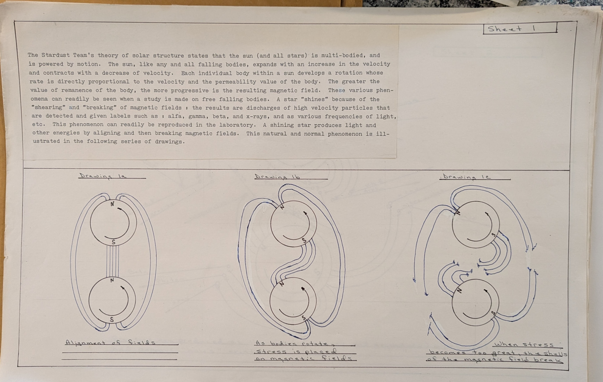

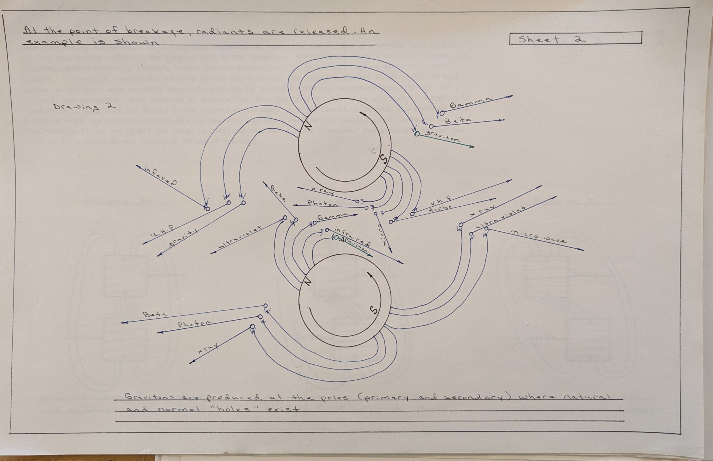

At the point of breakage, radiants are released. An example is shown

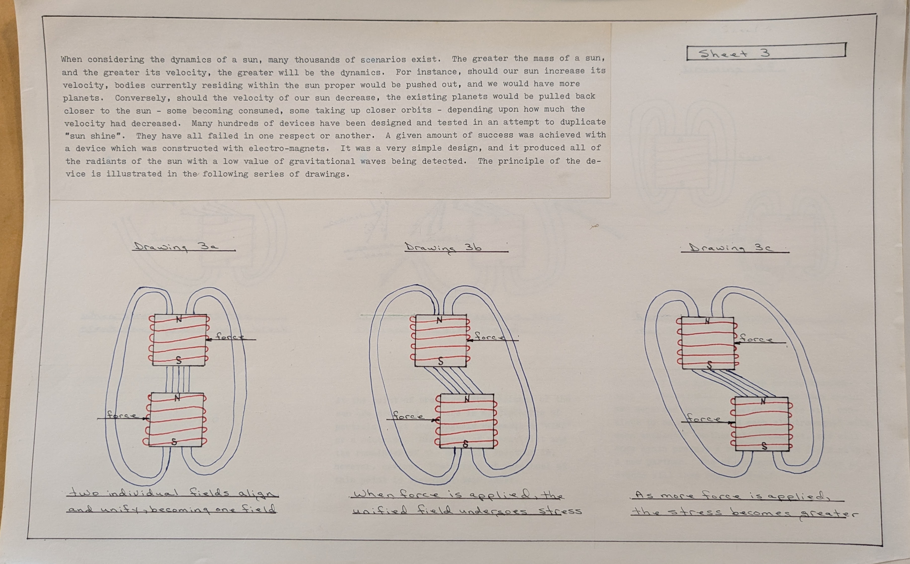

---

## Dynamics of the Sun

When considering the dynamics of a sun, many thousands of scenarios exist. The greater the mass of a and the greater its velocity, the greater will be the dynamics. For instance, should our sun increase velocity, bodies currently residing within the sun proper would be pushed out, and we would have more planets. Conversely, should the velocity of our sun decrease, the existing planets would be pulled closer to the sun - some becoming consumed, some taking up closer orbits - depending upon how much the velocity had decreased. Many hundreds of devices have been designed and tested in an attempt to duplicate "sun shine". They have all failed in one respect or another. A given amount of success was achieved with a device which was constructed with electro-magnets. It was a very simple design, and it produced all of the radiants of the sun with a low value of gravitational waves being detected. The principle of the device is illustrated in the following series of drawings.

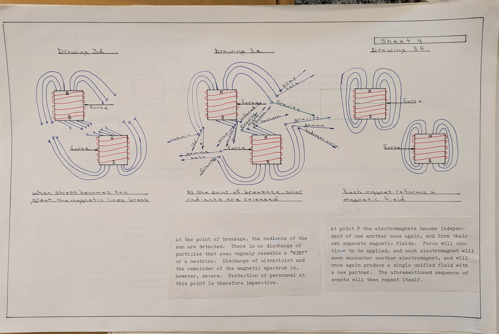

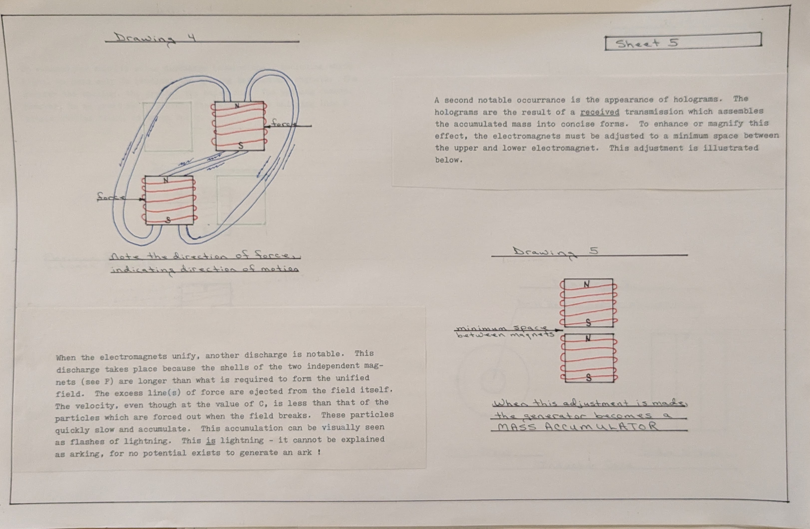

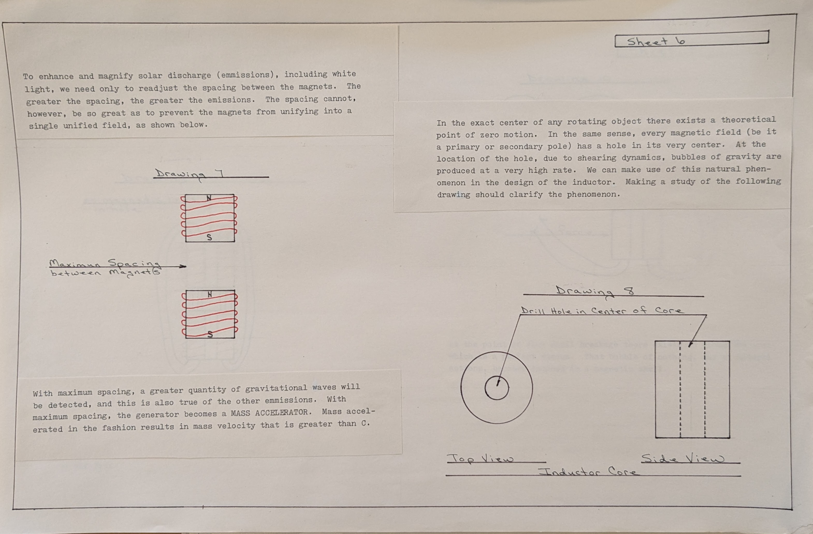

At the point of breakage, the radiants of the sun are detected. There is no discharge of particles that even vaguely resemble a "WIMP" or a neutrino. Discharge of ultraviolet and the remainder of the magnetic spectrum is, however, severe. Protection of personnel at this point is therefore imperative.

At point F the electromagnets become independent of one another once again, and form their own separate magnetic fields. Force will continue to be applied, and each electromagnet will soon encounter another electromagnet, and will once again produce a single unified field with a new partner. The aforementioned sequence of events will then repeat itself.

---

## Holograms

A second notable occurrence is the appearance of holograms. holograms are the result of a received transmission which assembles the accumulated mass into concise forms. To enhance or magnify this effect, the electromagnets must be adjusted to a minimum space between the upper and lower electromagnet. This adjustment is illustrated below.

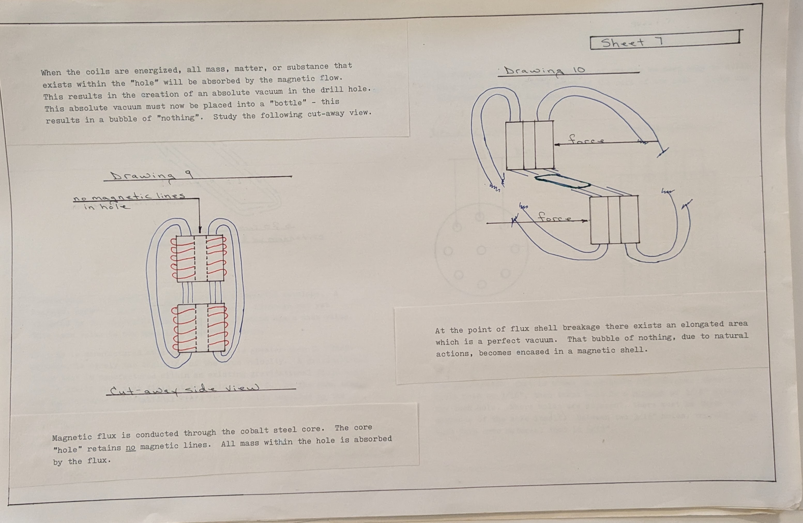

When the electromagnets unify, another discharge is notable. This discharge takes place because the shells of the two independent magnets (see F) are longer than what is required to form the unified field. The excess line(s) of force are ejected from the field itself. The velocity, even though at the value of C, is less than that of the particles which are forced out when the field breaks. These particles quickly slow and accumulate. This accumulation can be visually seen as flashes of lightning. This is lightning - it cannot be explained as arcing, for no potential exists to generate an arc !

---

## Solar Discharge Enhancement

To enhance and magnify solar discharge (emissions), including white light, we need only to readjust the spacing between the magnets. The greater the spacing, the greater the emissions. The spacing cannot, however, be so great as to prevent the magnets from unifying into a single unified field. as shown below.

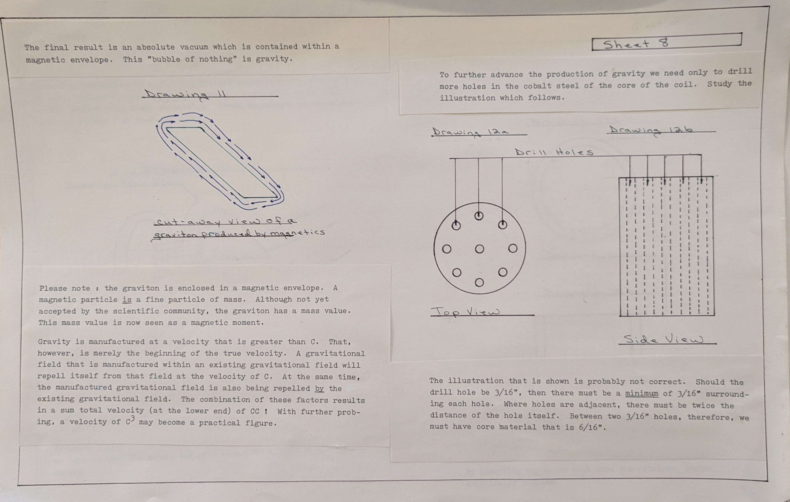

With maximum spacing, a greater quantity of gravitational waves will be detected, and this is also true of the other emissions. With maximum spacing, the generator becomes a MASS ACCELERATOR. Mass accelerated in the fashion results in mass velocity that is greater than C.

---

## The Inductor and Gravity Production

In the exact center of any rotating object there exists a theoretical point of zero motion. In the same sense, every magnetic field (be it a primary or secondary pole) has a hole in its very center. At the location of the hole, due to shearing dynamics, bubbles of gravity are produced at a very high rate. We can make use of this natural phenomenon in the design of the inductor. Making a study of the following drawing should clarify the phenomenon.

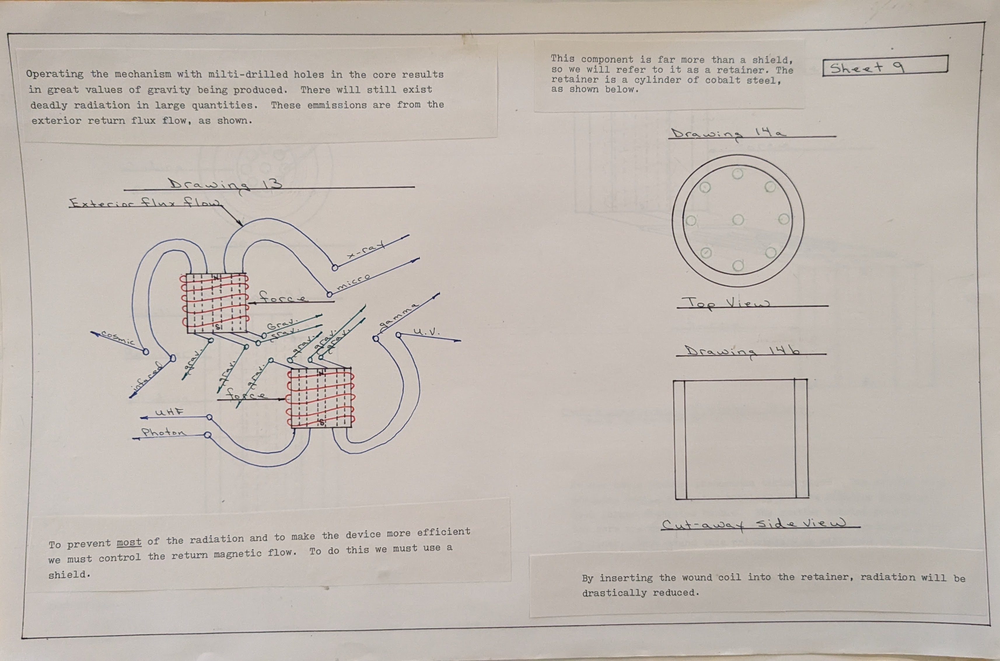

When the coils are energized, all mass, matter, or substance that exists within the "hole" will be absorbed by the magnetic flow. This results in the creation of an absolute vacuum in the drill hole. This absolute vacuum must now be placed into a "bottle" - this results in a bubble of "nothing". Study the following cut-away view.

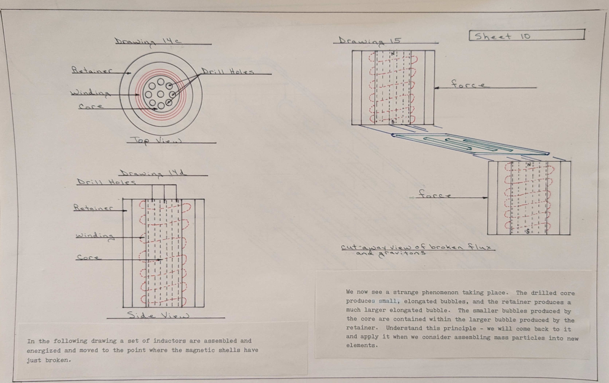

Magnetic flux is conducted through the cobalt steel core. The core "hole" retains no magnetic lines. All mass within the hole is absorbed by the flux.

At the point of flux shell breakage there exists an elongated area which is a perfect vacuum. That bubble of nothing, due to natural actions, becomes encased in a magnetic shell.

The final result is an absolute vacuum which is contained within a magnetic envelope. This "bubble of nothing" is gravity.

---

## The Graviton

Please note: the graviton is enclosed in a magnetic envelope. A magnetic particle is a fine particle of mass. Although not yet accepted by the scientific community, the graviton has a mass value. This mass value is now seen as a magnetic moment.

Gravity is manufactured at a velocity that is greater than C. That, however, is merely the beginning of the true velocity. A gravitational field that is manufactured within an existing gravitational field will repel itself from that field at the velocity of C. At the same time, the manufactured gravitational field is also being repelled by the existing gravitational field. The combination of these factors results in a sum total velocity (at the lower end) of CC ! With further probing, a velocity of c' may become a practical figure.

---

## Multi-Hole Core Design

To further advance the production of gravity we need only to drill more holes in the cobalt steel of the core of the coil. Study the illustration which follows.

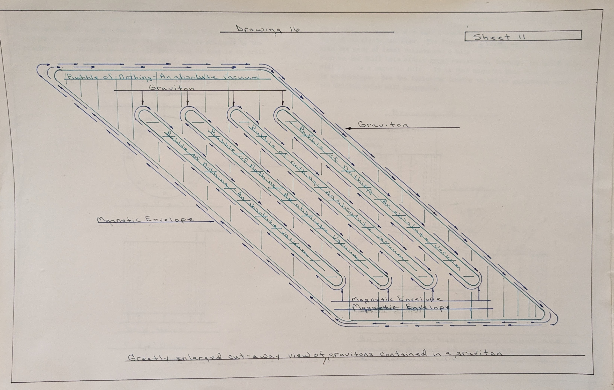

The illustration that is shown is probably not correct. Should the drill hole be 3/16", then there must be a minimum of 3/16" surrounding each hole. Where holes are adjacent, there must be twice the distance of the hole itself. Between two 3/16" holes, therefore, we must have core material that is 6/16".

Operating the mechanism with multi-drilled holes in the core results in great values of gravity being produced. There will still exist deadly radiation in large quantities. These emissions are from the exterior return flux flow, as shown.

---

## The Retainer

To prevent most of the radiation and to make the device more efficient we must control the return magnetic flow. To do this we must use a shield.

This component is far more than a shield, so we will refer to it as a retainer. The retainer is a cylinder of cobalt steel, as shown below.

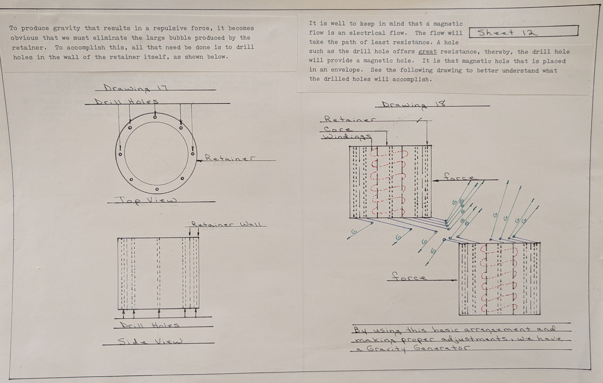

By inserting the wound coil into the retainer, radiation will be drastically reduced.

In the following drawing a set of inductors are assembled and energized and moved to the point where the magnetic shells have just broken.

We now see a strange phenomenon taking place. The drilled core produces small, elongated bubbles, and the retainer produces a much larger elongated bubble. The smaller bubbles produced by the core are contained within the larger bubble produced by the retainer. Understand this principle - we will come back to it and apply it when we consider assembling mass particles into new elements.

---

## Drawing 16 — Gravitons Contained in a Graviton

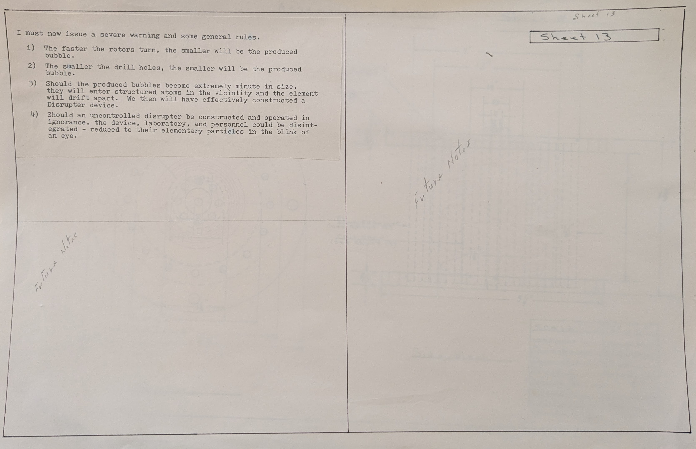

"Greatly enlarged cut-away view of gravitons contained in a graviton"

---

## Repulsive Force Production

To produce gravity that results in a repulsive force, it becomes obvious that we must eliminate the large bubble produced by the retainer. To accomplish this, all that need be done is to drill holes in the wall of the retainer itself, as shown below.

It is well to keep in mind that a magnetic flow is an electrical flow. The flow will take the path of least resistance. A hole such as the drill hole offers great resistance, thereby, the drill hole will provide a magnetic hole. It is that magnetic hole that is placed in an envelope. See the following drawing to better understand what the drilled holes will accomplish.

[Drawing — drilled retainer detail — see Sheet 13 / original scans]

---

## Warning and General Rules

I must now issue a severe warning and some general rules.

1) The faster the rotors turn, the smaller will be the produced bubble.

2) The smaller the drill holes, the smaller will be the produced bubble.

3) Should the produced bubbles become extremely minute in size, they will enter structured atoms in the vicinity and the element will drift apart. We then will have effectively constructed a Disrupter device.

4) Should an uncontrolled disrupter be constructed and operated in ignorance, the device, laboratory, and personnel could be disintegrated - reduced to their elementary particles in the blink of an eye.
